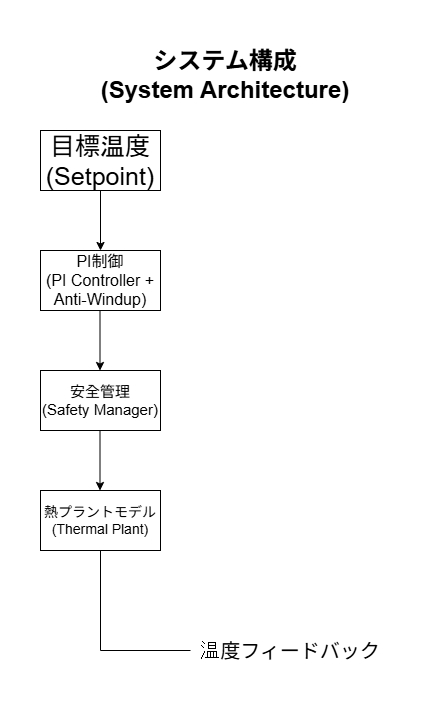
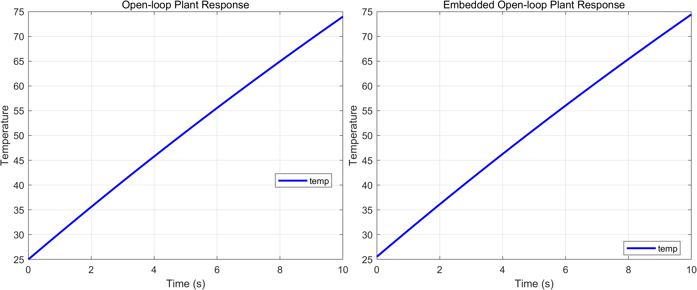
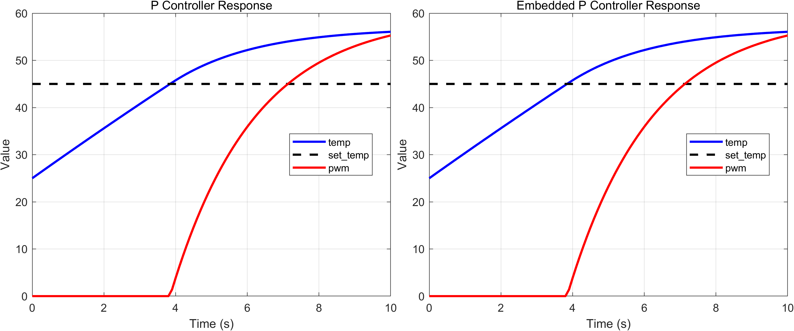
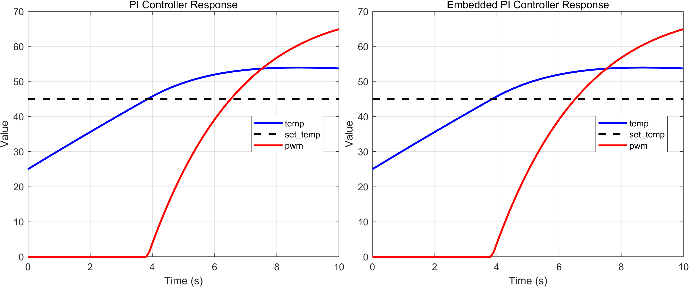
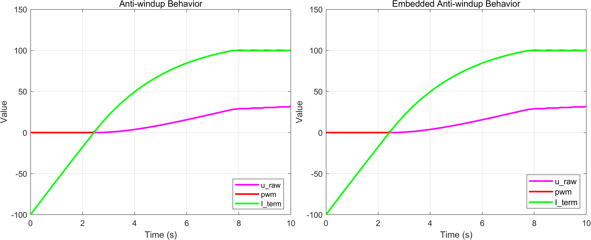
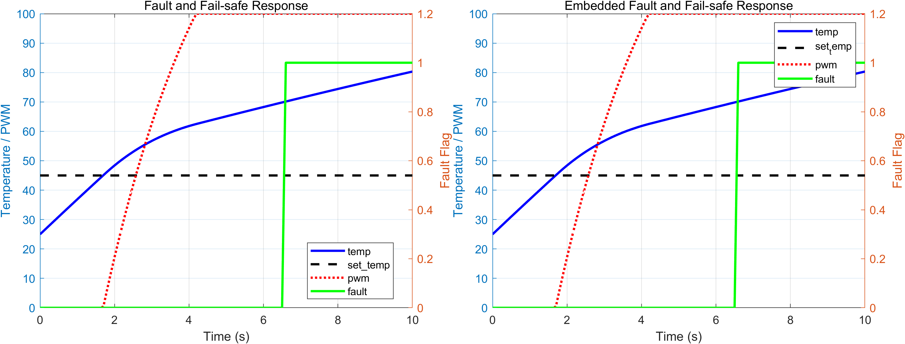
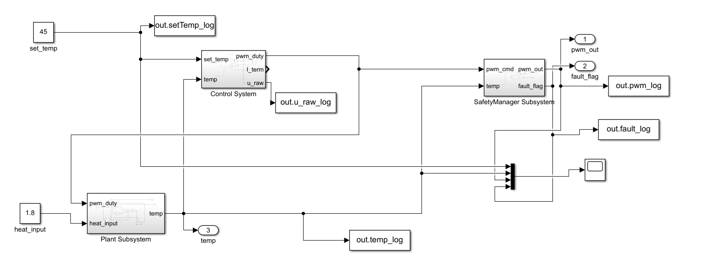
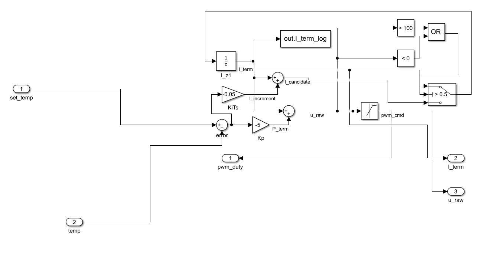
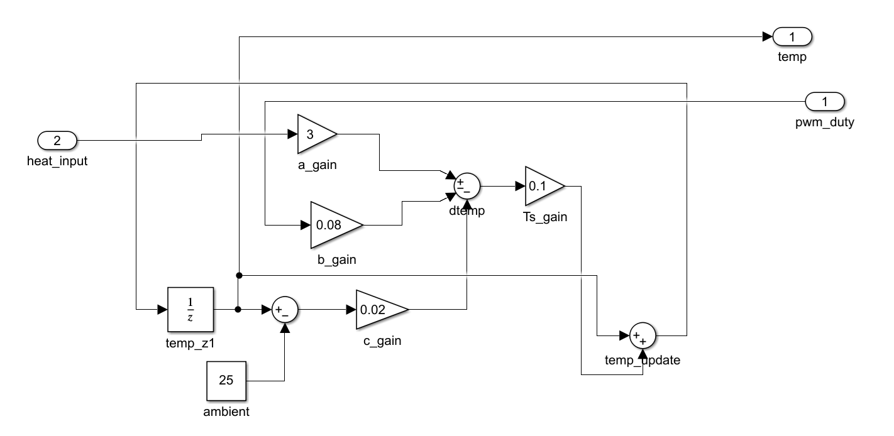
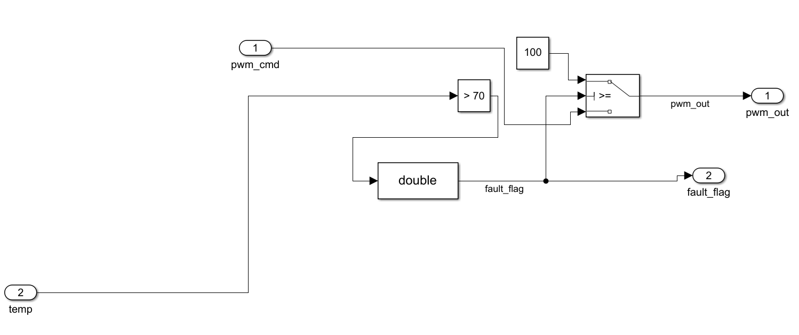

# RTOS-based Thermal Control System Using Simulink

Simulink で設計した温度制御アルゴリズムを、STM32 + FreeRTOS 環境で動作確認した個人プロジェクトです。  
このプロジェクトでは Software Plant を用いて閉ループ制御の動作を検証しました。

## Overview

- Simulink による温度制御モデル設計
- PI 制御 + Anti-windup
- STM32 + FreeRTOS での周期制御
- UART ログによる動作確認
- LED による Fault 状態表示

## System Architecture

本システムは、制御ロジック・安全管理・プラントモデルを分離した構成で設計されています。  
この構造は組み込み制御システムや ECU ソフトウェアのアーキテクチャを意識したものです。

制御アルゴリズムは PI 制御と Anti-Windup を組み合わせて構成されており、
Safety Manager が異常状態を監視し、異常発生時にはフェイルセーフ動作を実行します。



## 制御結果

### プラント応答 (Open-loop)



フィードバック制御がない場合、熱入力により温度が継続的に上昇することを確認できます。

---

### P制御



比例制御では温度誤差は減少しますが、定常偏差が残ることを確認しました。

---

### PI制御



積分項を追加することで定常偏差が解消され、目標温度への追従性能が改善されました。

---

### Anti-Windup 比較



アクチュエータ飽和時に積分項が過剰に増加する問題を防ぐため、
Anti-Windup 機構を適用しました。

---

### Fault / Fail-safe 動作



温度が安全閾値を超えた場合、Safety Manager が異常を検出し、
最大冷却出力によるフェイルセーフ動作を実行します。

## Control Modes

### Preset Mode

固定目標温度

```
set_temp = 45°C
heat_input = 1.8
検証シナリオによって heat_input パラメータを変更しました。
```

| 検証ケース | heat_input |
|------------|-----------|
| Plant / P制御 / PI制御 | 1.8 |
| Anti-windup 検証 | 変更 |
| Fault / Fail-safe 検証 | 変更 |


10秒間ログを出力

### Potentiometer Mode

ADC 入力から目標温度を決定

```
30°C ～ 60°C
```

1秒ごとに状態ログを出力

## RTOS Structure

```
ControlTask
  ├ control algorithm
  ├ safety manager
  └ plant update

InputTask
  ├ UART mode selection
  └ ADC setpoint input

LoggingTask
  └ UART monitoring
```

Queue を使用してタスク間でデータを受け渡しています。

## Project Structure

```
01_Design_Docs
02_Model_Simulation
└ results
03_Hardware_Implementation
```

## Simulation Model

### System Overview



### Control System



### Plant Subsystem



### SafetyManager Subsystem



## Development Environment

```
MCU        : STM32F446RE
RTOS       : FreeRTOS
Modeling   : MATLAB / Simulink
Language   : Embedded C
IDE        : STM32CubeIDE
```

## Notes

このバージョン (v1) では実センサではなく Software Plant を使用して制御アルゴリズムの検証を行いました。

今後の拡張予定

- 実温度センサ入力
- PWM ファン制御
- OLED 状態表示
- Fault / Fail-safe ロジック拡張
